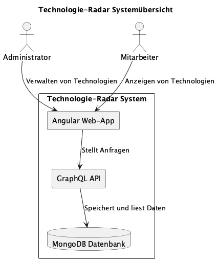

# Technologie-Radar - Architektur-Dokumentation

## 1. Einleitung und Ziele

### 1.1 Anforderungen
Das Technologie-Radar ist ein Werkzeug für Technologie-Management in Unternehmen oder für einzelne Software-Architekten und Engineers. Es bietet eine Visualisierung von Technologien, kategorisiert nach *Techniques*, *Tools*, *Platforms* sowie *Languages & Frameworks*. Der Reifegrad der Technologien wird über die Ringe *Assess*, *Trial*, *Adopt* und *Hold* dargestellt.

Das System besteht aus zwei Kernkomponenten:
- **Technologie-Radar-Administration** für CTOs und Tech-Leads zur Verwaltung von Technologien.
- **Technologie-Radar-Viewer** für Mitarbeiter zur Einsicht in die Technologien.

Detaillierte Anforderungen können [hier](https://github.com/web-programming-lab/web-programming-lab-projekt/blob/main/Technologie-Radar.md#anforderungen) nachgelesen werden.

### 1.2 Qualitätsziele

| Ziel | Beschreibung |
| ---- | ------------ |
| Usability | Die Anwendung soll eine intuitive Bedienbarkeit haben. |
| Performance | Der Technologie-Radar-Viewer soll in unter 1 Sekunde geladen sein. |
| Sicherheit | Nur autorisierte Benutzer dürfen Technologien verwalten. |

### 1.3 Stakeholder

| Rolle | Erwartung |
| ----- | --------- |
| CTO | Möchte neue Technologien hinzufügen und bestehende verwalten. |
| Tech-Lead | Bewertet Technologien und ordnet diese den entsprechenden Ringen zu. |
| Software Engineer | Nutzt den Technologie-Radar als Entscheidungshilfe. |
| Unternehmensleitung | Erwartet eine einfache und skalierbare Lösung zur Technologie-Verwaltung. |

## 2. Architektur-Beschränkungen
- Das System muss als Webanwendung implementiert werden.
- Frontend: **Angular mit TailwindCSS**.
- Backend: **GraphQL API mit Node.js**.
- Datenbank: **MongoDB**.
- Hosting in der Cloud.

## 3. Kontext und Scope
### 3.1 Geschäftskontext
Der Technologie-Radar ermöglicht es Unternehmen, technologische Entscheidungen datengetrieben und zentralisiert zu verwalten.

### 3.2 Technischer Kontext
- Nutzer greift über einen Webbrowser auf das System zu.
- Backend stellt eine GraphQL API bereit.
- Daten werden in einer MongoDB gespeichert.

## 4. Lösungsstrategie
- Verwendung eines modernen **SPA-Frameworks (Angular)** für eine flüssige User-Experience.
- **GraphQL** ermöglicht flexible und performante Abfragen.
- **MongoDB** speichert Technologien als flexible Dokumente.
- **JWT-basierte Authentifizierung** für gesicherte API-Zugriffe.

### 4.1 Qualitätszielabdeckung

| Ziel | Lösungsstrategie |
| ---- | ---------------- |
| Usability | Responsives Styling mittels Flexbox und Angular Breakpoint-Observern. |
| Performance | GraphQL API für flexible Abfragen. |
| Sicherheit | Authentifizierung und Authorisierung mittels JWT-Tokens. |

## 5. Bausteinsicht
### 5.1 Systemübersicht

Das System besteht aus den folgenden Hauptkomponenten:
- **Frontend (Angular) mit TailwindCSS** zur Darstellung der UI.
- **Backend (Node.js mit GraphQL)** zur Datenverarbeitung.
- **Datenbank (MongoDB)** zur Speicherung der Technologien.

Die Akteure "Administrator" und "Mitarbeiter" können über die Web-App den Tech-Radar betrachten.

## 6. Laufzeitsicht
### 6.1 Anmeldung und Zugriff auf Technologien
1. Nutzer meldet sich mit E-Mail und Passwort an.
2. JWT-Token wird vom Backend generiert und an den Client gesendet.
3. Nutzer kann Technologien anzeigen und verwalten (je nach Berechtigung).

## 7. Verteilungssicht
- **Hosting in der Cloud**.
- **Datenbank und API sind getrennte Services**.
- **Frontend wird als statische SPA ausgeliefert**.

## 8. Querschnittliche Konzepte
- **Authentifizierung über JWT**
- **GraphQL für flexible Datenabfragen**
- **ECharts zur Visualisierung des Radars**

## 9. Architekturentscheidungen

| Entscheidung | Begründung |
| ------------ | ----------- |
| GraphQL statt REST | Erlaubt flexible Abfragen, reduziert Overfetching. |
| Angular statt React | Bessere Strukturierung und Integration für Unternehmensprojekte. |
| MongoDB statt SQL | Flexiblere Speicherung von Technologie-Daten. |

## 10. Qualitätsanforderungen
### 10.1 Qualitätsbaum
- **Leistung:** Ladezeit unter 1s
- **Sicherheit:** Geschützte API-Zugriffe
- **Usability:** Einfache UI für Administratoren und Nutzer

### 10.2 Qualitätsszenarien
- Ein CTO kann in unter 5 Sekunden eine neue Technologie erfassen.
- Ein Mitarbeiter kann in unter 1 Sekunde eine Technologie einsehen.

## 11. Risiken und technische Schulden
- **GraphQL Security:** Absicherung gegen übermässige Abfragen.
- **Skalierbarkeit:** MongoDB-Cluster notwendig bei grosser Last.
- **Fehlende Multi-Tenant-Funktionalität:** Noch nicht umgesetzt.

## 12. Glossar

| Begriff | Bedeutung |
| ------- | --------- |
| Technologie-Radar | Eine Visualisierung von Technologien in einem Unternehmen. |
| CTO | Chief Technology Officer - Verantwortlich für Technologie-Strategie. |
| GraphQL | API-Technologie für flexible Abfragen. |
| JWT | JSON Web Token - Authentifizierungsmechanismus. |

