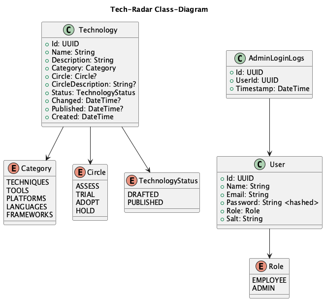

# Technologie-Radar - Architektur-Dokumentation

## 1. Einleitung und Ziele

### 1.1 Anforderungen
Das Technologie-Radar ist ein Werkzeug für Technologie-Management in Unternehmen oder für einzelne Software-Architekten und Engineers. Es bietet eine Visualisierung von Technologien, kategorisiert nach *Techniques*, *Tools*, *Platforms* sowie *Languages & Frameworks*. Der Reifegrad der Technologien wird über die Ringe *Assess*, *Trial*, *Adopt* und *Hold* dargestellt.

Das System besteht aus zwei Kernkomponenten:
- **Technologie-Radar-Administration** für CTOs und Tech-Leads zur Verwaltung von Technologien.
- **Technologie-Radar-Viewer** für Mitarbeiter zur Einsicht in die Technologien.

Detaillierte Anforderungen können [hier](https://github.com/web-programming-lab/web-programming-lab-projekt/blob/main/Technologie-Radar.md#anforderungen) nachgelesen werden.

### 1.2 Qualitätsziele

| Ziel | Beschreibung |
| ---- | ------------ |
| Usability | Die Anwendung soll eine intuitive Bedienbarkeit haben. |
| Performance | Der Technologie-Radar-Viewer soll in unter 1 Sekunde geladen sein. |
| Sicherheit | Nur autorisierte Benutzer dürfen Technologien verwalten. |

### 1.3 Stakeholder

| Rolle | Erwartung |
| ----- | --------- |
| CTO | Möchte neue Technologien hinzufügen und bestehende verwalten. |
| Tech-Lead | Bewertet Technologien und ordnet diese den entsprechenden Ringen zu. |
| Software Engineer | Nutzt den Technologie-Radar als Entscheidungshilfe. |
| Unternehmensleitung | Erwartet eine einfache und skalierbare Lösung zur Technologie-Verwaltung. |

## 2. Architektur-Beschränkungen
- Das System muss als Webanwendung implementiert werden.
- Frontend: **Angular mit TailwindCSS**.
- Backend: **GraphQL API mit Node.js**.
- Datenbank: **MongoDB**.
- Hosting in der Cloud.

## 3. Kontext und Scope
### 3.1 Geschäftskontext
Der Technologie-Radar ermöglicht es Unternehmen, technologische Entscheidungen datengetrieben und zentralisiert zu verwalten.

### 3.2 Technischer Kontext
- Nutzer greift über einen Webbrowser auf das System zu.
- Backend stellt eine GraphQL API bereit.
- Daten werden in einer MongoDB gespeichert.

## 4. Lösungsstrategie
- Verwendung eines modernen **SPA-Frameworks (Angular)** für eine flüssige User-Experience.
- **GraphQL** ermöglicht flexible und performante Abfragen.
- **MongoDB** speichert Technologien als flexible Dokumente.
- **JWT-basierte Authentifizierung** für gesicherte API-Zugriffe.

### 4.1 Qualitätszielabdeckung

| Ziel | Lösungsstrategie |
| ---- | ---------------- |
| Usability | Responsives Styling mittels Flexbox und Angular Breakpoint-Observern. |
| Performance | GraphQL API für flexible Abfragen. |
| Sicherheit | Authentifizierung und Authorisierung mittels JWT-Tokens. |


## 5. Bausteinsicht
### 5.1 Systemübersicht


Das System besteht aus den folgenden Hauptkomponenten:
- **Frontend (Angular) mit TailwindCSS** zur Darstellung der UI.
- **Backend (Node.js mit GraphQL)** zur Datenverarbeitung.
- **Datenbank (MongoDB)** zur Speicherung der Technologien.

Die Akteure "Administrator" und "Mitarbeiter" können über die Web-App den Tech-Radar betrachten.

### 5.2 Level 2
#### 5.2.1 Angular Web-App


Die Angular Web-App besteht aus einem kleinen Set von Angular Komponenten.
Diese Komponente sind für die Darstellung der verschiedenen Pages zuständig.
Mithilfe der zwei Services `AuthService` und `TechnologiesService` kommunizieren diese mit der GraphQL API.

Die Komponente `AppComponent` dient als Einstiegspunkt in die Applikation. Sie stellt den Router-Outlet dar und Routed gemäss der URL auf die verschiedenen Komponenten.

Es wird immer zuerst auf die Komponente `LoginComponent` gerouted, diese versucht den eingeloggten User über den `Me`-Node der GraphQL API und einen im localStorage gespeicherten JWT-Token aufzulösen. Falls dies nicht gelingt, kann davon ausgegangen werden, dass der Aufrufende Nutzer nicht eingeloggt ist oder sein Token abgeloffen ist, und er wird auf der Login Komponente aufgefordert, sich anzumelden. Falls der User aufgelöst werden kann, wird der Benutzer auf die Tech-Radar Komponente gerouted.

Die Tech-Radar Komponente dient als Kern der Applikation, Hier wird eine Auswahl der Kategorien der Technologien dargestellt. Aktuell als Kuchendiagramm. Mittels einem Klick auf die Kategorie, wird der Benutzer auf die `CategoryComponent` Komponente weitergeleitet.

Die `CategoryComponent` Komponente zeigt alle Technologien der entsprechenden Kategorie an. Die Technologien werden von der `TechnologyComponent` Komponente im Detail dargestellt. Auf dieser Übersicht können Technologien erstellt, entfernt oder verändert werden.

Die `TechnologyComponent` Komponente stellt die Technologie im Detail an. Falls der angemeldete Benutzer über die Rolle `Admin` verfügt, kann die Komponente eine Technologie löschen oder diese über einen Aufruf der `EditTechnologyDialogComponent` Komponente in einem Dialog bearbeiten.

Die `EditTechnologyDialogComponent` Komponente wird stets als Dialog aufgerufen. Über sie können bestehende Technologien bearbeitet werden oder neue Technologien erzeugt werden.

#### 5.2.2 GraphQL API
Die GraphQL API ist grundsätzlich ein Node.js Apollo GraphQL Server.
Das GraphQL Schema sieht wie folgt aus
```graphql
type Query {
  technologies(category: TechnologyCategory): [Technology]
  technologyById(id: String): Technology
  me: User
}

type Mutation {
  createTechnology(input: CreateTechnologyInput): Technology
  login(input: LoginInput): LoginOutput
  editTechnology(input: EditTechnologyInput): Technology
  deleteTechnology(input: DeleteTechnologyInput): DeleteResponse
}

type Technology {
  id: String
  name: String
  description: String
  category: TechnologyCategory
  circle: TechnologyCircle
  circleDescription: String
  status: TechnologyStatus
  created: String
  published: String
  changed: String
}

type LoginOutput {
  successful: Boolean
  jwtToken: String
}

type User {
  name: String
  email: String
  role: Role
}

type DeleteResponse {
  successful: Boolean
}

input DeleteTechnologyInput {
  id: String!
}

input LoginInput {
  email: String!
  password: String!
}

input CreateTechnologyInput {
  name: String!
  description: String!
  category: TechnologyCategory!
  circle: TechnologyCircle
  circleDescription: String
  status: TechnologyStatus!
}

input EditTechnologyInput {
  id: String!
  name: String
  description: String
  category: TechnologyCategory
  circle: TechnologyCircle
  circleDescription: String
  status: TechnologyStatus
}

enum TechnologyStatus {
  DRAFTED
  PUBLISHED
}

enum TechnologyCircle {
  ASSESS
  TRIAL
  ADOPT
  HOLD
}

enum TechnologyCategory {
  TECHNIQUES
  TOOLS
  PLATFORMS
  LANGUAGES
  FRAMEWORKS
}

enum Role {
  EMPLOYEE
  ADMIN
}
```

Die Queries und Mutations werden als Resolver-Funktionen registriert. Diese Funktionen können über das Context-Objekt von Apollo Server die Authentifikations-Informationen des aufrufenden Benutzers abrufen und auf die Data-Services zugreifen.

Da Node.js oder Apollo-GraphQL über keinen Dependency-Injection-Container verfügt, kann dieses Context-Objekt an seiner Stelle verwendet werden. Die Authentifikations-Informationen werden pro Request aufgelöst. Ebenso werden die Data-Services pro Request instanziert. Hierbei könnte man den Ressourcenverbrauch noch optimieren, indem man Factory-Funktionen in den Context "injected" und diese Factory-Funktionen von den Resolver-Funktionen verwendet werden, um eine Instanz eines Services bei Bedarf zu erzeugen.

Die Data-Services greifen auf die Datenbank zu und sehen wie folgt aus:


Die Data-Services dienen als Schnittstelle zur Datenbank.

Die JWT-Tokens werden mittels dem User-Service pro Request geprüft und der entsprechende Benutzer aus der Datenkbank gelesen.

Wie der Benutzer und die gespeicherten Technologien auf der Datenbank aussehen, kann im folgenden Kapitel nachgelesen werden.

#### 5.2.3 Datenbank
Als Datenbanktechnologie wird im Rahmen des Tech-Radars MongoDB verwendet. Die Datenbank enthält 3 Tabellen/Dokumente.
Diese sind im folgenden Klassendiagram ersichtlich, welches gleichzeitig auch die Models, welche in der GraphQL API verwendet werden, darstellt.



## 6. Laufzeitsicht
### 6.1 Anmeldung und Zugriff auf Technologien
1. Nutzer ruft die Angular SPA auf.
2. Angular SPA versucht die Informationen des aufrufenden Benutzer mittels der `me`-Query abzurufen.
3. GraphQL API findet keinen JWT-Token im Header und retourniert einen `ANONYMOUS_ACCESS` GraphQL-Error.
4. Angular SPA fängt den GraphQL-Error ab und rerouted den Benutzer auf die Login sicht.
5. Benutzer gibt Email und Passwort an.
6. Angular SPA ruft `login` GraphQL-Mutation auf.
7. GraphQL API versucht den Benutzer mittels der angegebenen Email-Adresse auf der Datenbank zu finden.
8. Falls Benutzer gefunden wird das übermittelte Passwort mit dem auf der Datenbank abgelegenen Salt gehashed und verglichen.
9. Falls Email und gehashtes Passwort übereinstimmen wird ein neuer JWT-Token generiert und dieser dem Frontend als Antwort übermittelt.
10. Angular SPA liest den JWT-Token und legt ihn im localStorage ab und ruft die tech-radar Sicht auf.
11. Benutzer klickt auf eine Kategorie und ruft die Kategorie-Komponente auf.
11. Kategorie-Komponente Angular Komponente ruft die `technologies` GraphQL-Query auf mit dem JWT Token im Authorization Header und der ausgewählten Kategorie als Parameter.
12. GraphQL API ermittelt bevor sie den `technologies`-Resolver aufruft den aufrufenden Benutzer mittels dem JWT Token und legt die Informationen im GraphQL Context-Objekt ab.
13. GraphQL API ruft den `technologies`-Resolver auf, welcher die Technologien der angegebenen Kategorie aus der Datenbank liest und filtert diese mittels der Benutzer-Rolle, welche im Context-Objekt aufzufinden ist.

### 6.2 Erstellen eines Technologie
1. Nutzer navigiert zur Kategorie Komponente.
2. Angular SPA ermittelt die Rolle des aufrufenden Benutzer mittels der `me`-Query. Falls die Rolle `ADMINISTRATOR` ist, zeigt sie den "+" Button im Header an.
3. Benutzer klickt auf den "+" Button.
4. Angular SPA ruft einen Angular-Material Dialog auf.
5. Ein leeres Formular wird im Dialog angezeigt.
6. Benutzer füllt die benötigten Felder aus und klickt auf Speichern.
7. Falls das Formular als `valid` gilt (alle nötigen Felder ausgefüllt), sendet die Angular SPA die `CreateTechnology`-Mutation ab.
8. GraphQL API ermittelt die Rolle des Benutzers, falls diese ungleich `ADMINIISTRATOR` ist, wird ein `NOT_AUTHORIZED` GraphQL-Error zurückgegeben. Ansonsten werden die Eingaben nochmals validiert und falls diese Korrekt sind, auf der Datenbank gespeichert.
9. GraphQL API retourniert das veränderte Technologie-Objekt.
10. Angular SPA aktualisiert den GraphQL Cache mit dem aktualisierten Technologie-Objekt mittels der Refetch-Query `technologies`.


### 6.3 Bearbeiten einer Technologie
1. Nutzer navigiert zur Kategorie-Komponente und sieht die Liste der Technologie der ausgewählten Kategorie.
2. Angular SPA ermittelt die Rolle des aufrufenden Benutzer mittels der `me`-Query. Falls die Rolle `ADMINISTRATOR` ist, zeigt sie den Bearbeiten-Button an.
3. Benutzer klickt auf den Bearbeiten-Button.
4. Angular SPA ruft einen Angular-Material Dialog auf und übergibt die Informationen der existierenden Technologie.
5. Die existierende Technologie wird als ein Formular im Dialog angezeigt.
6. Benutzer verändert einzelne Felder und klickt auf Speichern.
7. Falls das Formular als `valid` gilt (alle nötigen Felder ausgefüllt), sendet die Angular SPA die `EditTechnology`-Mutation ab.
8. GraphQL API ermittelt die Rolle des Benutzers, falls diese ungleich `ADMINISTRATOR` ist, wird ein `NOT_AUTHORIZED` GraphQL-Error zurückgegeben. Ansonsten werden die Eingaben nochmals validiert und falls diese Korrekt sind, auf der Datenbank gespeichert.
9. GraphQL API retourniert das veränderte Technologie-Objekt.
10. Angular SPA aktualisiert den GraphQL Cache mit dem aktualisierten Technologie-Objekt mittels der Refetch-Query `technologies`.

## 7. Verteilungssicht
- **Hosting in der Cloud** vorgesehen.
- **Datenbank und API sind getrennte Services**.
- **Frontend wird als statische SPA ausgeliefert**.

## 8. Querschnittliche Konzepte
- **Authentifizierung über JWT**
- **GraphQL für flexible Datenabfragen**
- **ECharts zur Visualisierung des Radars**

## 9. Architekturentscheidungen

| Entscheidung | Begründung |
| ------------ | ----------- |
| GraphQL statt REST | Erlaubt flexible Abfragen, reduziert Overfetching. |
| Angular statt React | Bessere Strukturierung und Integration für Unternehmensprojekte. |
| MongoDB statt SQL | Flexiblere Speicherung von Technologie-Daten. |

## 10. Qualitätsanforderungen
### 10.1 Qualitätsbaum
- **Leistung:** Ladezeit unter 1s
- **Sicherheit:** Geschützte API-Zugriffe
- **Usability:** Einfache UI für Administratoren und Nutzer

## 11. Risiken und technische Schulden
- **GraphQL Security:** Absicherung gegen übermässige Abfragen.
- **Skalierbarkeit:** MongoDB-Cluster notwendig bei grosser Last.
- **Fehlende Multi-Tenant-Funktionalität:** Noch nicht umgesetzt.
- **Technologien nicht im Home-Screen angezeigt:** Die Idee wäre es gewesen, ECharts zu nutzen, um ein Kuchendiagramm der Technologien darzustellen und die Technologien als zweite Chart darüberzulegen und ihre Position mittels der zugewiesenen Kategorie zu ermitteln, damit diese am richtigen Ort angezeigt werden. Wurde noch nicht umgesetzt aufgrund von Zeitmangel.
- **Technologie-Entwürfe ohne zugewiesene Kategorie nicht sichtbar:** Dies würde sich erübrigen, sobald alle Technologien im Home-Screen angezeigt werden können.

## 12. Glossar

| Begriff | Bedeutung |
| ------- | --------- |
| Technologie-Radar | Eine Visualisierung von Technologien in einem Unternehmen. |
| CTO | Chief Technology Officer - Verantwortlich für Technologie-Strategie. |
| GraphQL | API-Technologie für flexible Abfragen. |
| JWT | JSON Web Token - Authentifizierungsmechanismus. |
| SPA | Single Page Appliaction |

